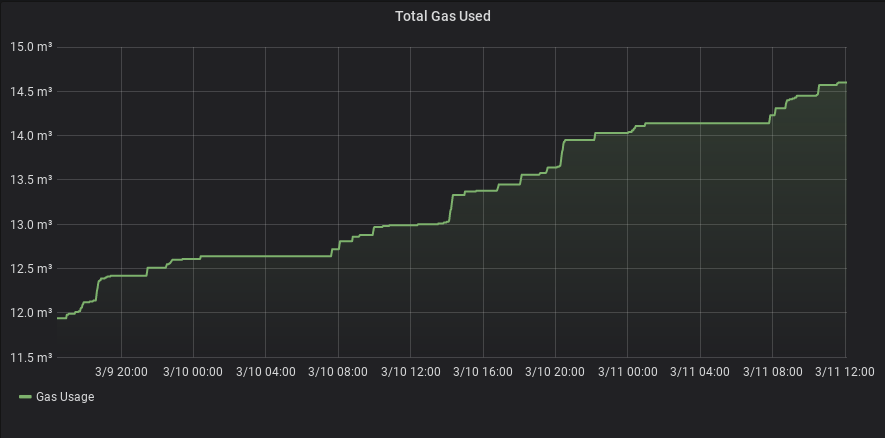
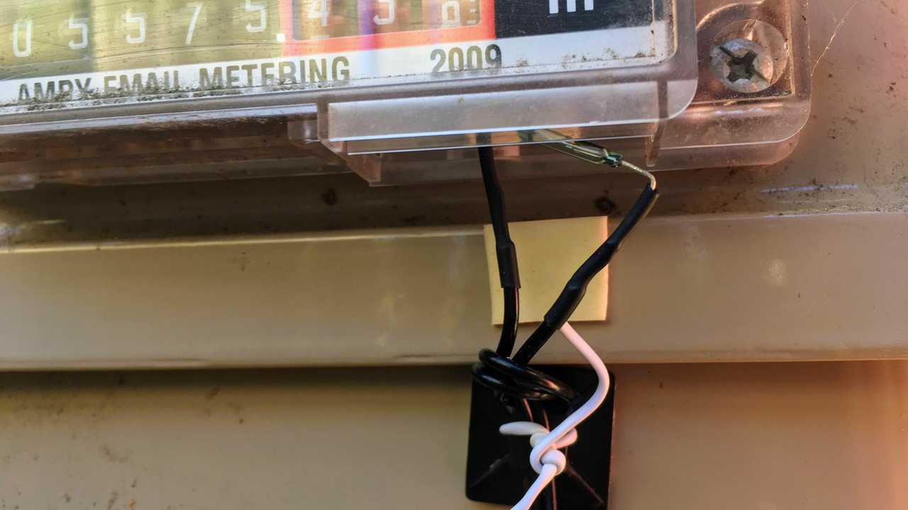
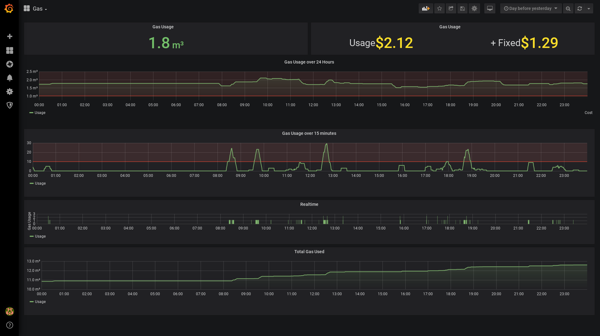

> Monitor a Gas or Water Odometer with a Raspberry Pi

## What is this?

It is a small program, written in Go that is designed to run on a Raspberry Pi.

It starts a web server that serves up Prometheus metrics at `/metrics`. You can
then use Prometheus & Grafana to track your water or gas usage.

The metric is called `odometer` by default, but can be configured using
an environment variable.

Every time the "fastest" barrel makes one revolution, the Prometheus gauge will
increase by 1.



## How do I use this?

You will need to connect [GPIO Pin 26](https://pinout.xyz/pinout/pin37_gpio26)
to a [reed switch](https://en.wikipedia.org/wiki/Reed_switch) to the 3v pin, as
well as a pull-down resistor to ground.


Then place the reed switch below the "fastest" barrel of your gas/water
odometer. On most meters, this barrel has a magnet embedded inside it that will
trigger the reed switch to close and complete the circuit.



## Environment Variables

### `GAUGE_NAME`

The name of the Prometheus metric.

Default value: `odometer`.

### `GAUGE_DESCRIPTION`

The description of the Prometheus metric. Not particularly important, but
useful if you have a lot of different metrics. 

Default value: `Number of times the odometer has cycled.`.

## Deploy To Balena

This project is designed to be deployed with [Balena](http://balena.io/).

They have [fantastic
documentation](https://www.balena.io/docs/learn/getting-started/raspberry-pi2/go/)
for helping you get started.

Sign up for a free account, create a project, install their software on your Pi
and then upload this project.

```bash
git clone https://github.com/stayradiated/pi-odometer
cd pi-odometer
balena push <your-project-name>
```

## Prometheus Config

I am using Docker Compose to launch Prometheus & Grafana.

### `docker-compose.yml`

```yaml
version: "3"
services:
  prom:
    image: prom/prometheus
    volumes:
     - ./prometheus.yml:/etc/prometheus/prometheus.yml
    command: "--config.file=/etc/prometheus/prometheus.yml --storage.tsdb.path=/prometheus"
    ports:
     - 9090:9090
  grafana:
    image: grafana/grafana
    ports:
     - "3000:3000"
    depends_on:
      - prom
```

### `prometheus.yml`

```yaml
scrape_configs:
  - job_name: 'pi-odometer'
    scrape_interval: 5s
    static_configs:
      - targets: ['192.168.0.14'] # replace with the IP address of your Pi
```

### My Grafana Dashboard

This is my Grafana dashboard.

**Gas Usage**

- How much gas used over the selected time period, and how much that gas cost
  us (broken into the variable and fixed charges).

**Gas Usage over 24 hours**

Shows how much gas we are using on a daily basis. 

**Gas Usage over 15 minutes**

Shows when a large amount of gas is used, such as when someone has a shower

**Realtime**

This is usage over the last 30 seconds, useful for seeing when the Pi picked up
a signal from the gas meter.

**Total Gas Used**

Shows how long it takes us to use a cubic meter of gas (about 10 hours!)



You can import my dashboard by copy/pasting the following into Grafana.

```json
{"__inputs":[{"name":"DS_PROMETHEUS","label":"Prometheus","description":"","type":"datasource","pluginId":"prometheus","pluginName":"Prometheus"}],"__requires":[{"type":"grafana","id":"grafana","name":"Grafana","version":"6.6.0"},{"type":"panel","id":"graph","name":"Graph","version":""},{"type":"datasource","id":"prometheus","name":"Prometheus","version":"1.0.0"},{"type":"panel","id":"stat","name":"Stat","version":""}],"annotations":{"list":[{"builtIn":1,"datasource":"-- Grafana --","enable":true,"hide":true,"iconColor":"rgba(0, 211, 255, 1)","name":"Annotations & Alerts","type":"dashboard"}]},"editable":true,"gnetId":null,"graphTooltip":0,"id":null,"links":[],"panels":[{"cacheTimeout":null,"datasource":"${DS_PROMETHEUS}","gridPos":{"h":3,"w":12,"x":0,"y":0},"id":8,"links":[],"options":{"colorMode":"value","fieldOptions":{"calcs":["delta"],"defaults":{"mappings":[{"id":0,"op":"=","text":"N/A","type":1,"value":"null"}],"max":100,"min":0,"nullValueMode":"connected","thresholds":{"mode":"absolute","steps":[{"color":"green","value":null},{"color":"red","value":80}]},"title":"","unit":"m3"},"overrides":[],"values":false},"graphMode":"none","justifyMode":"center","orientation":"auto"},"pluginVersion":"6.6.0","targets":[{"expr":"gas_usage / 100","refId":"A"}],"timeFrom":null,"timeShift":null,"title":"Gas Usage","type":"stat"},{"cacheTimeout":null,"datasource":"${DS_PROMETHEUS}","gridPos":{"h":3,"w":12,"x":12,"y":0},"id":11,"links":[],"options":{"colorMode":"value","fieldOptions":{"calcs":["delta"],"defaults":{"decimals":2,"mappings":[{"id":0,"op":"=","text":"N/A","type":1,"value":"null"}],"nullValueMode":"connected","thresholds":{"mode":"absolute","steps":[{"color":"yellow","value":null}]},"title":"","unit":"currencyUSD"},"overrides":[],"values":false},"graphMode":"none","justifyMode":"center","orientation":"auto"},"pluginVersion":"6.6.0","targets":[{"expr":"((gas_usage / 100) * 10.672 * (9.836 / 100)) * 1.15","legendFormat":"Usage","refId":"A"},{"expr":"day_of_month() * ((109.842 + 2) / 100) * 1.15","legendFormat":"+ Fixed","refId":"B"}],"timeFrom":null,"timeShift":null,"title":"Gas Usage","type":"stat"},{"aliasColors":{"Cost":"rgba(255, 152, 48, 0)","Usage":"#7eb26d"},"bars":false,"dashLength":10,"dashes":false,"datasource":"${DS_PROMETHEUS}","fill":2,"fillGradient":2,"gridPos":{"h":6,"w":24,"x":0,"y":3},"hiddenSeries":false,"id":15,"legend":{"avg":false,"current":false,"max":false,"min":false,"show":true,"total":false,"values":false},"lines":true,"linewidth":2,"nullPointMode":"null","options":{"dataLinks":[]},"percentage":false,"pointradius":2,"points":false,"renderer":"flot","seriesOverrides":[{"alias":"Cost","yaxis":2}],"spaceLength":10,"stack":false,"steppedLine":false,"targets":[{"expr":"increase(gas_usage[24h]) / 100","instant":false,"legendFormat":"Usage","refId":"A"},{"expr":"((increase(gas_usage[24h]) / 100) * 10.672 * (9.836 / 100)) * 1.15","legendFormat":"Cost","refId":"B"}],"thresholds":[{"colorMode":"critical","fill":true,"line":true,"op":"gt","value":1,"yaxis":"left"}],"timeFrom":null,"timeRegions":[],"timeShift":null,"title":"Gas Usage over 24 Hours","tooltip":{"shared":true,"sort":0,"value_type":"individual"},"transparent":true,"type":"graph","xaxis":{"buckets":null,"mode":"time","name":null,"show":true,"values":[]},"yaxes":[{"format":"m3","label":null,"logBase":1,"max":null,"min":"0.75","show":true},{"format":"currencyUSD","label":null,"logBase":1,"max":null,"min":null,"show":false}],"yaxis":{"align":false,"alignLevel":null}},{"aliasColors":{},"bars":false,"dashLength":10,"dashes":false,"datasource":"${DS_PROMETHEUS}","fill":2,"fillGradient":2,"gridPos":{"h":6,"w":24,"x":0,"y":9},"hiddenSeries":false,"id":10,"legend":{"avg":false,"current":false,"max":false,"min":false,"show":true,"total":false,"values":false},"lines":true,"linewidth":2,"nullPointMode":"null","options":{"dataLinks":[]},"percentage":false,"pointradius":2,"points":false,"renderer":"flot","seriesOverrides":[],"spaceLength":10,"stack":false,"steppedLine":false,"targets":[{"expr":"increase(gas_usage[15m])","legendFormat":"Usage","refId":"A"}],"thresholds":[{"colorMode":"critical","fill":true,"line":true,"op":"gt","value":10,"yaxis":"left"}],"timeFrom":null,"timeRegions":[],"timeShift":null,"title":"Gas Usage over 15 minutes","tooltip":{"shared":true,"sort":0,"value_type":"individual"},"type":"graph","xaxis":{"buckets":null,"mode":"time","name":null,"show":true,"values":[]},"yaxes":[{"format":"short","label":null,"logBase":1,"max":null,"min":null,"show":true},{"format":"short","label":null,"logBase":1,"max":null,"min":null,"show":true}],"yaxis":{"align":false,"alignLevel":null}},{"aliasColors":{},"bars":false,"dashLength":10,"dashes":false,"datasource":"${DS_PROMETHEUS}","fill":10,"fillGradient":0,"gridPos":{"h":4,"w":24,"x":0,"y":15},"hiddenSeries":false,"id":2,"legend":{"avg":false,"current":false,"max":false,"min":false,"show":true,"total":false,"values":false},"lines":true,"linewidth":0,"nullPointMode":"null","options":{"dataLinks":[]},"percentage":false,"pointradius":2,"points":false,"renderer":"flot","seriesOverrides":[],"spaceLength":10,"stack":false,"steppedLine":true,"targets":[{"expr":"increase(gas_usage[30s])","legendFormat":"Usage","refId":"A"}],"thresholds":[],"timeFrom":null,"timeRegions":[],"timeShift":null,"title":"Realtime","tooltip":{"shared":true,"sort":0,"value_type":"individual"},"type":"graph","xaxis":{"buckets":null,"mode":"time","name":null,"show":true,"values":[]},"yaxes":[{"decimals":0,"format":"short","label":"Gas Usage","logBase":1,"max":null,"min":null,"show":true},{"format":"dateTimeAsIso","label":null,"logBase":1,"max":null,"min":null,"show":true}],"yaxis":{"align":false,"alignLevel":null}},{"aliasColors":{},"bars":false,"dashLength":10,"dashes":false,"datasource":"${DS_PROMETHEUS}","fill":4,"fillGradient":2,"gridPos":{"h":6,"w":24,"x":0,"y":19},"hiddenSeries":false,"id":4,"legend":{"avg":false,"current":false,"max":false,"min":false,"show":true,"total":false,"values":false},"lines":true,"linewidth":2,"nullPointMode":"null","options":{"dataLinks":[]},"percentage":false,"pointradius":2,"points":false,"renderer":"flot","seriesOverrides":[],"spaceLength":10,"stack":false,"steppedLine":false,"targets":[{"expr":"gas_usage / 100","intervalFactor":1,"legendFormat":"Usage","refId":"A"}],"thresholds":[],"timeFrom":null,"timeRegions":[],"timeShift":null,"title":"Total Gas Used","tooltip":{"shared":true,"sort":0,"value_type":"individual"},"type":"graph","xaxis":{"buckets":null,"mode":"time","name":null,"show":true,"values":[]},"yaxes":[{"decimals":null,"format":"m3","label":null,"logBase":1,"max":null,"min":null,"show":true},{"format":"currencyUSD","label":"","logBase":1,"max":null,"min":null,"show":false}],"yaxis":{"align":false,"alignLevel":null}}],"refresh":false,"schemaVersion":22,"style":"dark","tags":[],"templating":{"list":[]},"time":{"from":"now-2d/d","to":"now-2d/d"},"timepicker":{"refresh_intervals":["5s","10s","30s","1m","5m","15m","30m","1h","2h","1d"]},"timezone":"","title":"Gas","uid":"4HXnmuQZk","version":21}
```
