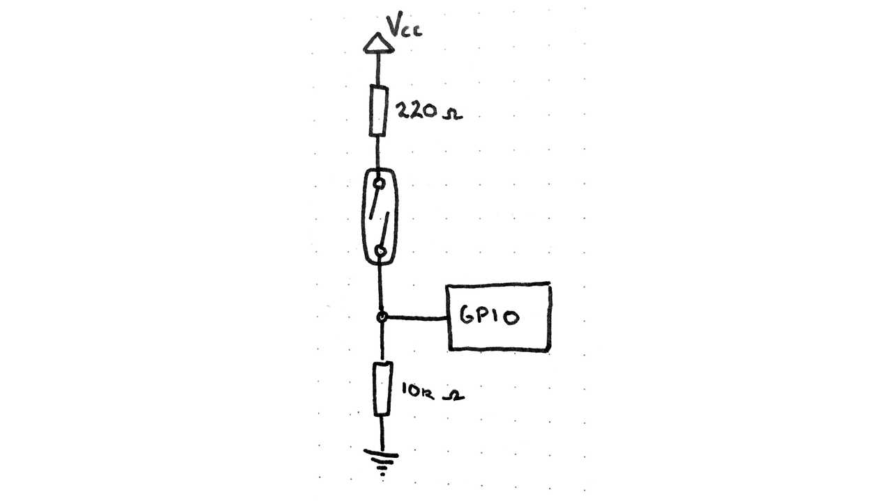

> Monitor a Gas or Water Odometer with a Raspberry Pi

## What is this?

It is a small program, written in Go that is designed to run on a Raspberry Pi.

It starts a web server on port 8080 that serves up Prometheus metrics at
`/metrics`. You can then use Prometheus & Grafana to track your water or gas
usage.


## How do I use this?

You will need to connect [GPIO Pin 26](https://pinout.xyz/pinout/pin37_gpio26)
a [reed switch](https://en.wikipedia.org/wiki/Reed_switch) to the 3v pin, as
well as a pull-down resistor to ground.



Then place the reed switch below the "fastest" barrel of your gas/water
odometer. On most meters, this barrel has a magnet embedded inside it that will
trigger the reed switch to close and complete the circuit.


## Deploy To Balena

This project is designed to be deployed with [Balena](http://balena.io/).

They have [fantastic
documentation](https://www.balena.io/docs/learn/getting-started/raspberry-pi2/go/)
for helping you get started.

Sign up for a free account, create a project, install their software on your Pi
and then upload this project.

```bash
git clone https://github.com/stayradiated/pi-odometer
cd pi-odometer
balena push <your-project-name>
```
